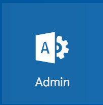

# Setup new domain for O365 Manualy


1. Login into your linux server

 ``` 
$ssh sd-53250.dedibox.fr
```  

 Bind your domain to your server, I recomend you to follow : <https://github.com/ninsuo/beast-one/blob/master/doc/dns.md>
in my case I am adding a second domain name (primary already binded)

2. open `/etc/bin/named.conf.local` , and add the following to it replace `enrollme.eu` by your domain name :
  
 ```dns
zone "enrollme.eu" {
     type master;
     file "/etc/bind/db.enrollme.eu";
     allow-transfer {
        62.210.137.235;
        217.70.177.40;
     };
     allow-update { none; };
};
``` 
save and close. 

3. Edit `db.137.210.62` (in your case db.revip) add your new domain in my case `enrollme.eu`  
 
 ```dns 
60      IN      PTR     enrollme.eu.  
``` 
save and close.
 
4. Create and edit `db.enrollme.eu` (in your case it would be db.yourdomain.ext), also change 62.2010.137.235 by your linux server IP.

 ```dns
;
; BIND data file for enrollme.eu
;
$ORIGIN enrollme.eu.
$TTL    86400
@       IN      SOA     ns.enrollme.eu. john.pigeret.gmail.com. (
                        1498825112      ; Serial
                        10800           ; Refresh
                        3600            ; Retry
                        604800          ; Expire
                        10800 ) ; Negative Cache TTL
;
@       IN      NS      ns.enrollme.eu.
@       IN      A       62.210.137.235
ns      IN      A       62.210.137.235
```   
save and close.

5. Login to your DNS provider (Gandi in my case)
6. Go to your domain list (as shown in [startoverview](startoverview.md) )
7. Click on the domain you just bind to your server
 

8. Click on Glue Record Management and add ns.yourdomain.ext, IP of your server, then click `Save`
   

9. Now Go to Modify servers, do has below for your server, Click `Submit` : 
   

10. Wait a while, once you are able to ping yourdomain.ext then it is OK.

 ```bash
enola@mobilutils:~$ ping enrollme.eu
PING enrollme.eu (62.210.137.235) 56(84) bytes of data.
64 bytes from 62-210-137-235.rev.poneytelecom.eu (62.210.137.235): icmp_seq=1 ttl=64 time=0.015 ms
64 bytes from 62-210-137-235.rev.poneytelecom.eu (62.210.137.235): icmp_seq=2 ttl=64 time=0.020 ms
64 bytes from 62-210-137-235.rev.poneytelecom.eu (62.210.137.235): icmp_seq=3 ttl=64 time=0.021 ms
```  

11. Go to Office 365 admin portal [O365 Admin portal](https://portal.office.com/adminportal/home#/homepage)  

   

12. Click on `Settings`, then `Domains`  

    
  
   

13. Click on `+Add domain` and put your domain `enrollme.eu` in my case  

  

14. Click Next, and Click on MX Record, then Verify :  

 

15. on you linux box edit /etc/bind/db.enrollme.eu and add the below, then save

 ```bash
;;MICROSOFT STEP 1
ms11689905.msv1.invalid.    3600        IN      A       62.210.137.235
@                             3600      IN      MX      37367   ms11689905.msv1.invalid.
```

16. restart bind9

 ```bash
$sudo service bind9 restart
```

17. Go back to O365, click `verify`
   - If you get an error, wait a few minutes  

18. Once you get to the second step, see below :  

 

19. Select on `I'll manage my own DNS records`, then Click `Next` :  

 
 
20. Now you will be presented with the below  

   
   
   

21. Go back to your linux server, edit `/etc/bind/db.enrollme.eu`,  Comment what's under `MICROSOFT SECOND STEP 1`  

 ```bash
;;MICROSOFT STEP 1
;ms11689905.msv1.invalid.    3600       IN      A       62.210.137.235
;@                            3600      IN      MX      37367   ms11689905.msv1.invalid.
```  

22. Add the below reflecting your domain (as below)  

 ```bash
;MICROSOFT SECOND STEP 2
@        IN    TXT            "v=spf1 a:protection.outlook.com -all"
@          3600  IN             TXT     "v=spf1 include:spf.protection.outlook.com -all"
@          3600  IN             MX      0       enrollme-eu.mail.protection.outlook.com.
autodiscover     3600           IN      CNAME   autodiscover.outlook.com.
sip                             3600    IN      CNAME   sipdir.online.lync.com.
lyncdiscover                    3600    IN      CNAME   webdir.online.lync.com.
msoid                                   3600    IN      CNAME   clientconfig.microsoftonline-p.net.
enterpriseregistration                  3600    IN      CNAME   enterpriseregistration.windows.net.
enterpriseenrollment                    3600    IN      CNAME   enterpriseenrollment.manage.microsoft.com.
_sip._tls                               3600    IN      SRV     100     1       443        sipdir.online.lync.com.
_sipfederationtls._tcp                  3600    IN      SRV     100     1       5061       sipfed.online.lync.com.
```

23. restart bind9 server
 
 ```bash
sudo service bind9 restart
```

24. Go back to O365 Wizard, click `Verify`, you shall see the below :

 

25. If you have errors, wait a bit (2mins) or verify your file `db.enrollme.eu`, if you still have problems contact me, I would be glade to help.


You are done for the first peace :).


A good thing would be to create a user and send him an email. It will also be required for DMARK.

 * [Setup Mail Account with our new binded domain](O365_AddUserOnNewDomain.md)

It is highly recommended to set DKIM then DMARK

 * [Setup DKIM (Domain Key Identified Mail) for Office 365](O365_SetupDKIM.md)
 * [Setup Linux bind record DMARC ( Domain-based Message Authentication, Reporting and Conformance ) for Office 365](O365_SetupDMARCWithLinux.md)
