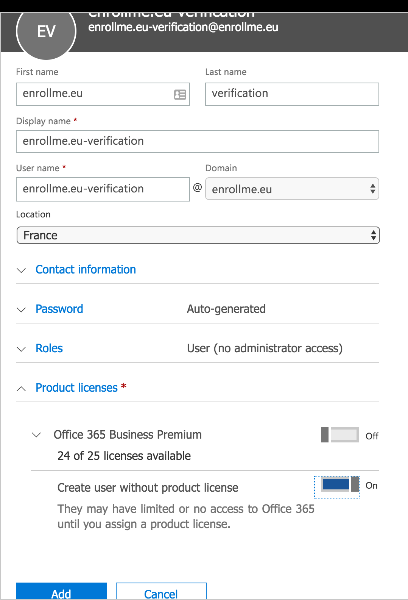
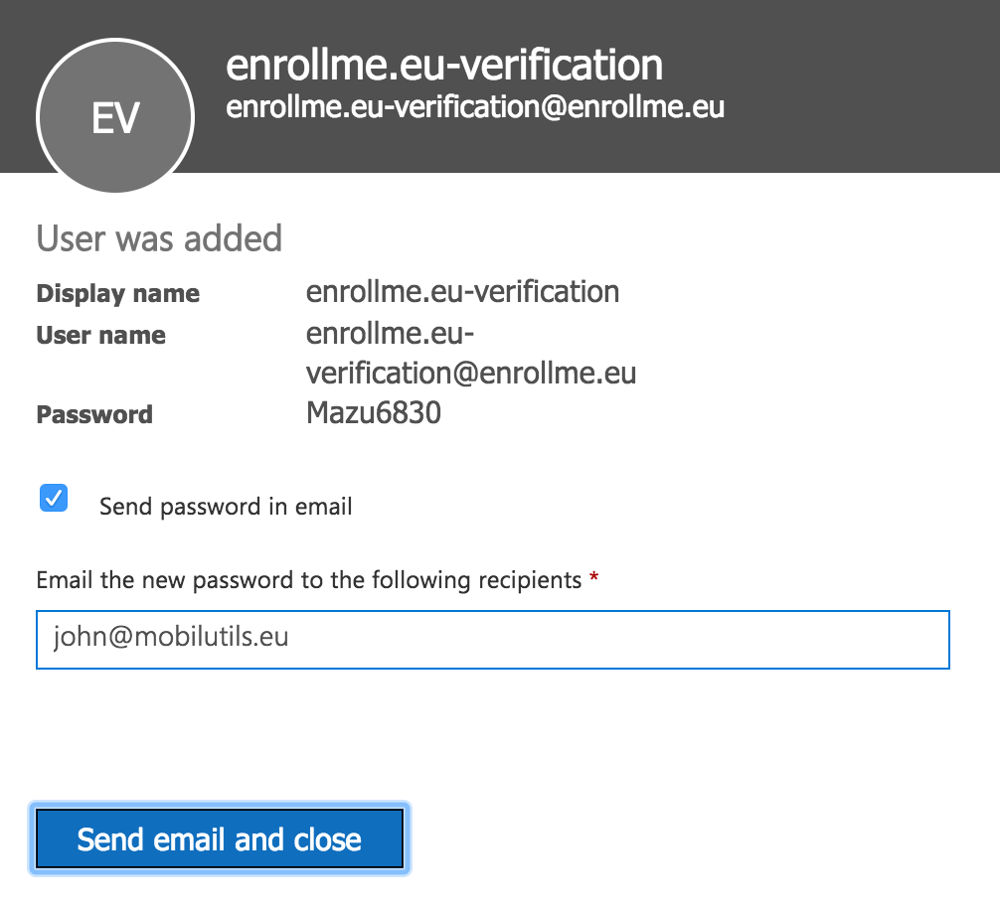
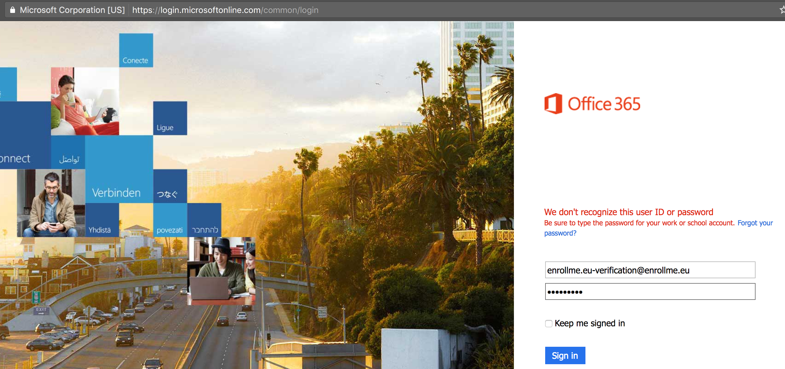
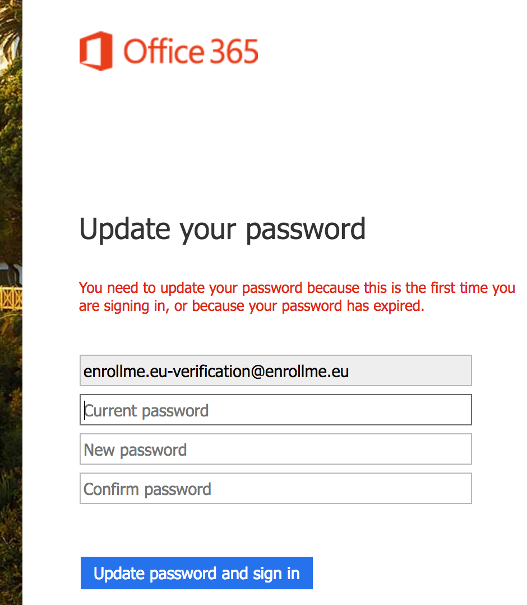

# Setup Mail Account with our new binded domain

We will create a Mail account with name : enrollme.eu-verification@enrollme.eu  

1. Go to `+Add User`, Fill, add a password and Click on `Add` at the bottom.  

   

2. Click and `send email and close` :  

 

3. Open an incognito Windows and try to login with new user account : [https://login.microsoftonline.com/](https://login.microsoftonline.com/)
Once credentials typed Click on `Sign in` :    

 

4. If asked for change the password, `Update password and sign in` :  

  

 OK you have a mail account with your own domainname !

It is recommended to setup DMARC.  
 * [Setup Linux DNS record DMARC ( Domain-based Message Authentication, Reporting and Conformance ) for Office 365](O365_SetupDMARCWithLinux.md)   

 * [You could also go back to the main page](../README.md)  

