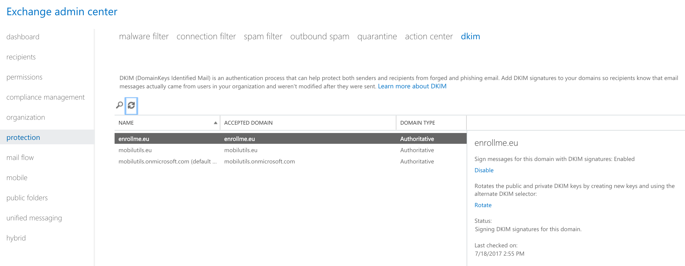

# Setup DKIM for your new domain on O365


1. Login to your linux server and add the 'selectors' :    

 ```bash
$ssh sd-53250.dedibox.fr
```

2. Edit `/etc/bind/db.enrollme.eu`, add the below at the end of the file :  
Make the change to reflect your domain...

 ```bash
;MICROSOFT DKIM
selector1._domainkey	3600	IN	CNAME	selector1-enrollme-eu._domainkey.enrollme.onmicrosoft.com.
selector2._domainkey	3600	IN	CNAME	selector2-enrollme-eu._domainkey.enrollme.onmicrosoft.com.
```
/!\ Be sure you didn't make any mistake, if you have to edit file after asking Microsoft it will take time to be taking into account... (my case it took me a couple of hours before being able to enable it.

3. Save the file, close it, restart bind service :  

 ```bash
$sudo /etc/init.d/bind9 restart
```
  
4. Go to google to force flush cache, put your domain name then in RRType CNAME, because selectors are CNAME records :  
  

5. Go to Office 365 admin portal :  
  

6. On the left menu Click on `Exchange` :  
 

7. Under section `Protection` click on `dkim` :   
 

8. Under section :  


9. Select your domain, and click on `enable` on the right, if you see the below wait few minutes to few hours ( I had to wait ~1h) :  


10. Wait and click on `enable` again, You shall see this :  


11. Now we will check DKIM is well set, go here : <http://dkimvalidator.com/>


12. Copy the email address, in my case :   PYTyc8NuJI1p41@dkimvalidator.com  

13. Go to your outlook client or webinterface and login with your new email account for me ( enrollme.eu-verification@enrollme.eu ): 
Send an e-mail for email you copied on previous step `@dkimvalidator.com` .  


14. Go back to dkimvalidator site, and Click on `View Results`


15. Verify tests passes 

* [You could also go back to the main page](../README.md)  