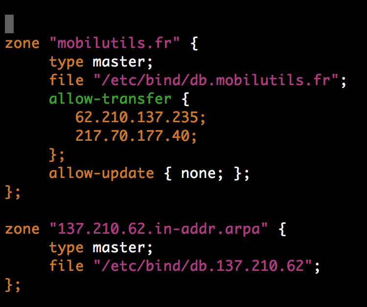

Setting up your DNS

This documentation is mostly inspired/copyied from my dear friend, ninsuo [ninsuo github](https://github.com/ninsuo).
If you want to set up a primary DNS, have a look at this  : [Setting up a primary DNS](https://github.com/ninsuo/beast-one/blob/master/doc/dns.md)

## Setting up a secondary DNS server

Ok, let's take it seriously. We have a server, an IP and a bound primary domain name `mobilutils.eu` in my case. We need to set up our secondary DNS server. 

Note about what I want to set :
DNS : mobilutils.fr
IP : 62.210.137.235
mail : webmaster.mobilutils.com (webmaster@mobilutils.com)


Now, let's declare our forward zone configuration file in `/etc/bind/named.conf.local`. Add the following:

  

in text if you want to copy/paste
```
zone "mobilutils.fr" {
     type master;
     file "/etc/bind/db.mobilutils.fr";
     allow-transfer {
        62.210.137.235;
        217.70.177.40;
     };
     allow-update { none; };
};
```

Note: here, `217.70.177.40` is gandi's (my registrar) given secondary dns.

Now, create the zone in `/etc/bind/db.mobilutils.fr`  
In your case it would be `/etc/bin/db.<YOURDOMAIN>` :  

```zone
;
; BIND data file for mobilutils.eu
;
$TTL    86400
$ORIGIN mobilutils.fr.
@       IN      SOA     ns.mobilutils.fr. webmaster.mobilutils.com. (
                        1707041830      ; Serial
                        ;604800          ; Refresh
                        3600          ; Refresh -> for test purpose!! 604800 is good for production ;)
                        86400           ; Retry
                        2419200         ; Expire
                        604800 )        ; Negative Cache TTL
;
@       IN      NS      ns.mobilutils.eu.
@       IN      A       62.210.137.235
ns      IN      A       62.210.137.235
```

As serial, put a timestamp based number (like YYMMDDHHII) to ensure its uniqueness.

Replace `mobilutils.fr` by your domain name, and `62.210.207.60` by your server's IP address. `webmaster.mobilutils.com` can be anything you want, ending with a dot.

**The spf1 record is used to allow this domain to send emails. Never put a typo here, this may arm your domain reputation for years, resulting on your emails to end up as spam in most providers' mailboxes.**

You can obviously add all your dns records at the bottom of this file, for example we can already set up our reverse dns to have a fancy name when requests leave the server (I just added `the`, to end up with `the.beast.systems`).

Now, restart your bind9 server:

```sh
sudo service bind9 restart
```

We now need to configure the reverse zone. In `/etc/bind/named.conf.local`, you should add:

```
zone "207.210.62.in-addr.arpa" {
     type master;
     file "/etc/bind/db.207.210.62";
};
```

Note: IP of my server is `62.210.207.60`, so I built `207.210.62` using the 3 first numbers of my IP in reverse order. 

Now open `/etc/bind/db.207.210.62` and add the following content:

```zone
;
; BIND reverse data file for 62.210.207.XXX interface
;
$TTL    86400
@       IN      SOA     ns.beast.systems. root.beast.systems. (
                        1706171315      ; Serial
                         604800         ; Refresh
                          86400         ; Retry
                        2419200         ; Expire
                         604800 )       ; Negative Cache TTL
;
@       IN      NS      ns.beast.systems.
60      IN      PTR     ns.beast.systems.
```

Replace `beast.systems` by your domain name, use a Serial based on the current date (here, 17/06/17 13:15 becomes `1706171315`), and the `60` at the bottom left by the last digit of your IP address.

Restart again your bind9 server:

```sh
sudo service bind9 restart
```

Check your syslog to find eventual errors.

```sh
sudo tail -250f /var/log/syslog
```

You can also use dig, the DNS lookup utility, to check your configuration:

```sh
dig @localhost beast.systems
```

Now, in the registrar where your domain `beast.systems` is stored:

- add a `NS IN A 62.210.207.60` record in the zone file

- set a glue domain record `ns` that points to your ip address `62.210.207.60`

- wait that `ns.beast.systems` respond to ping with the right ip address (it can take several hours)

- request to change your name servers and use `ns.beast.systems` as primary server, and use your registrar's secondary nameserver as a backup.

- go to google's public dns [flush cache](https://developers.google.com/speed/public-dns/cache) page, and flush your domain name.

- when you'll be able to ping the.beast.systems, it will mean your primary server is all set up and ready. 
