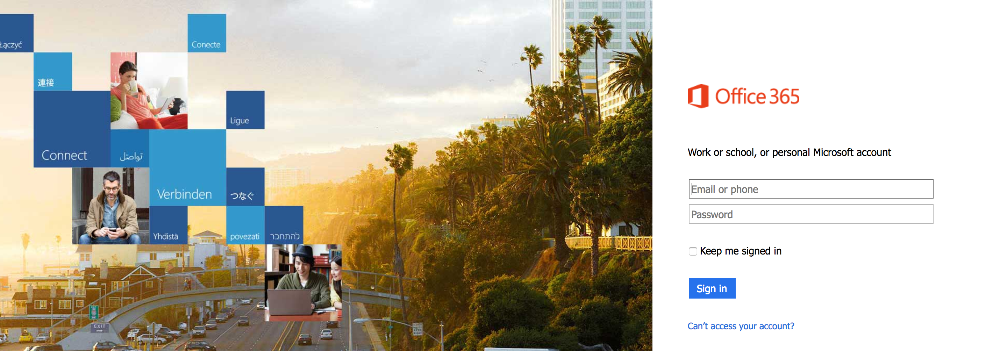
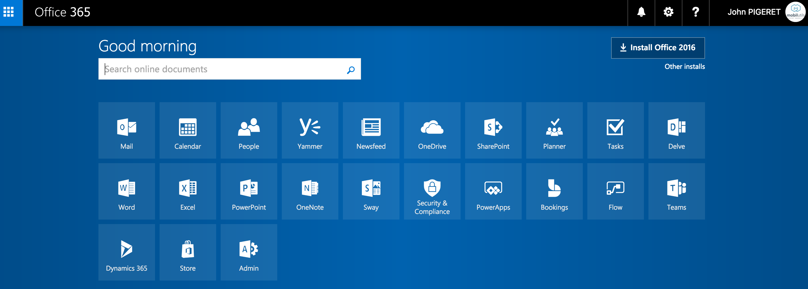
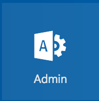
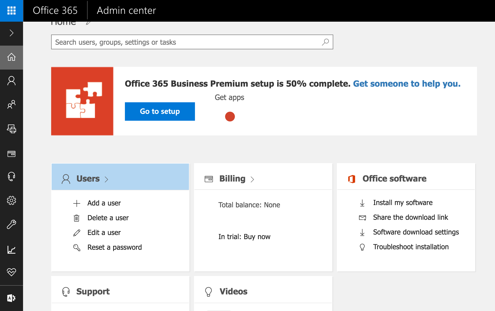
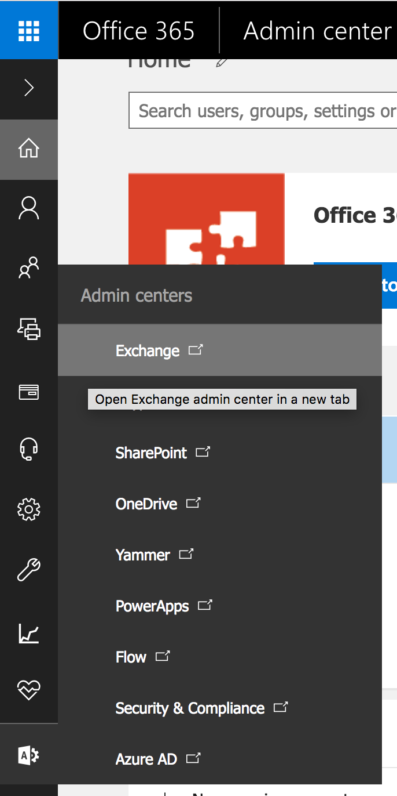
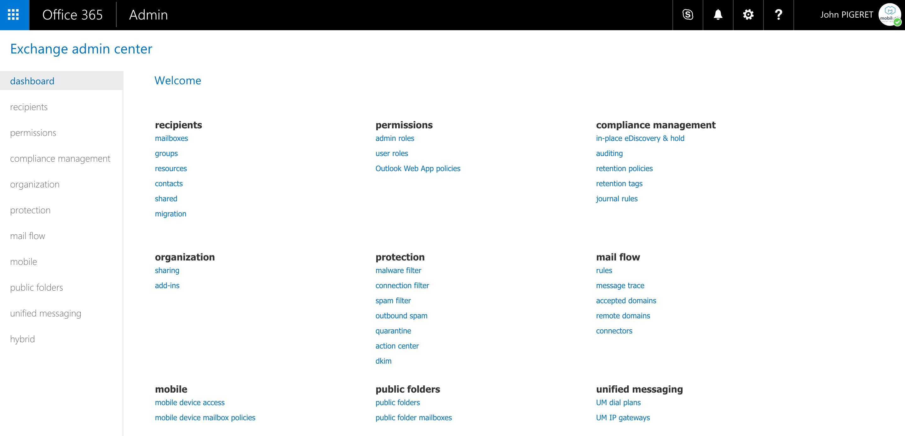
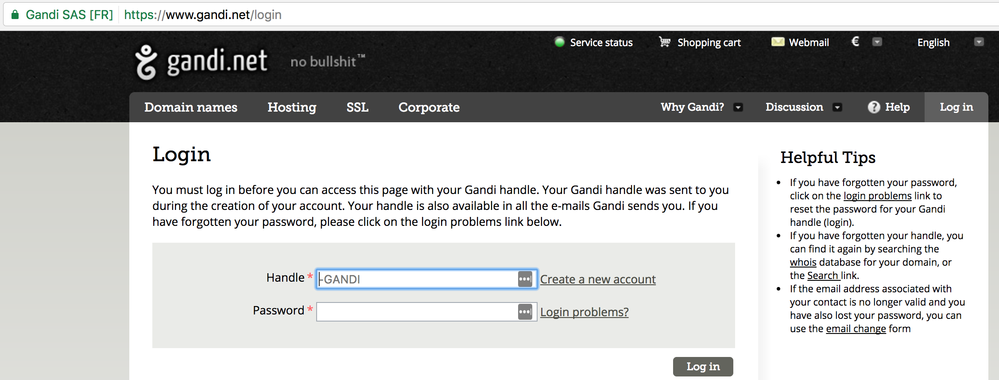
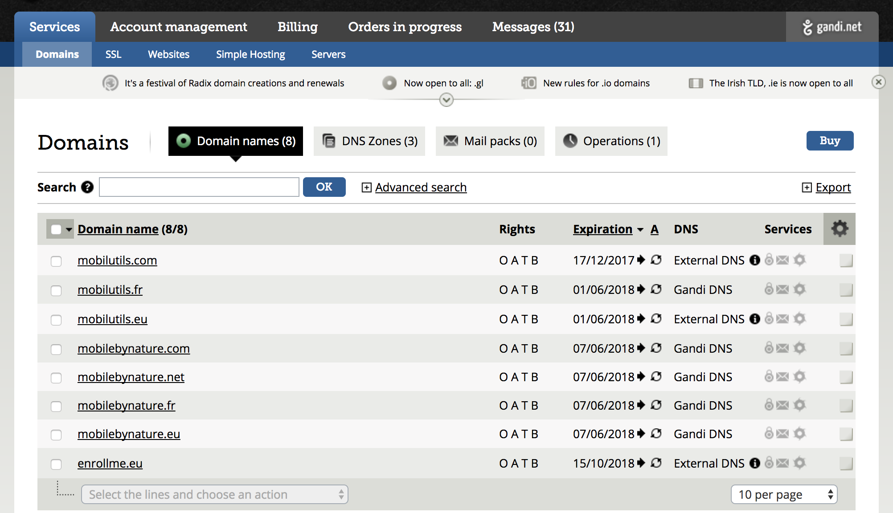
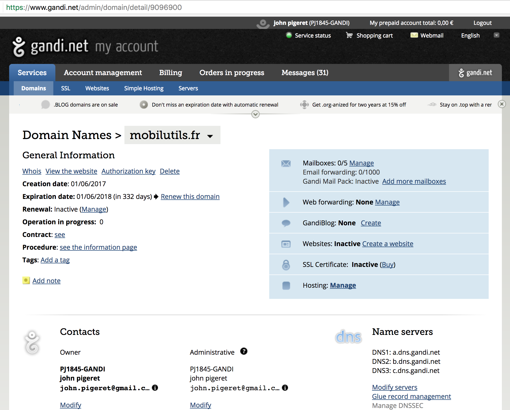

## First of all you shall be able to login in Microsoft Office 365 :  
note I am using Office 365 Business, nevertheless O365 Business Essentials and O365 Enterprise plan shall let you do the same.    
1) go to login.microsoftonline.com  
  
2) once logged in you should see something similar to this  
  
3) if you are admin you should see this icon :  
  
4) Click on the Admin icon, to access the admin portal :  

5) Bottom of left pane you will have an icon, put your cursor on it :

6) Click on Exchange, to get access to outlook admin portal  


you will need to get to this Outlook Admin portal few times in this tutorial.

## Second verify you have ssh access to your Linux Box

1) I have a server hosted at sd-53250.dedibox.fr accessible on port 22
my unprivilege user is user  
 
```bash
$ssh sd-53250.dedibox.fr
Warning: Permanently added 'sd-53250.dedibox.fr' (ECDSA) to the list of known hosts.

The programs included with the Debian GNU/Linux system are free software;
the exact distribution terms for each program are described in the
individual files in /usr/share/doc/*/copyright.

Debian GNU/Linux comes with ABSOLUTELY NO WARRANTY, to the extent
permitted by applicable law.
You have new mail.
Last login: Tue Jul  4 10:04:46 2017 from lfbn-1-4376-119.w92-170.abo.wanadoo.fr
```  
2) now that we are in we want to see if we have root access (personnaly I leverage sudo to do so), it might ask you for your password to leverage sudo, in my case it doesn't (R.T.F.M ;) )  
 
```bash
$sudo su
#
```
3) you can type whoami to verify you are root  
 
```bash
# whoami
root
#
```  
4) we also want to verify bind9 is installed :  

```bash
# dpkg --list | grep ii | grep bind
ii  bind9                          1:9.9.5.dfsg-9+deb8u11           amd64        Internet Domain Name Server
ii  bind9-host                     1:9.9.5.dfsg-9+deb8u11           amd64        Version of 'host' bundled with BIND 9.X
ii  bind9utils                     1:9.9.5.dfsg-9+deb8u11           amd64        Utilities for BIND
ii  libbind9-90                    1:9.9.5.dfsg-9+deb8u11           amd64        BIND9 Shared Library used by BIND
```
5) if you have bind9 listed, it's ok, if not go we will install it :  

```bash
# apt-get install bind9
...
```  
6) once done redo the step with dpkg to verify it is listed as installed.  

You shall also have a new directory /etc/bind .For a fresh installed bind it shall looks like the below when listing the folder :  

```bash
# ls /etc/bind/
bind.keys  db.127	  db.255  db.root	  named.conf.default-zones
  named.conf.options	zones.rfc1918		db.0	
  db.empty	db.local  named.conf	named.conf.local	rndc.key
```  

Later on, we will work here in conjonction with O365 instructions.

## Third access your DNS provider (Gandi in my case)
1) Go to your provider, for me : <https://www.gandi.net/login> :  
  

2) On the upper Left Click on Services, then Domains :   
  

3) Click on the domain you want to associate with O365, in my case mobilutils.fr  
  

We will come here later on ;).

that's it for now you can go back to the main readme. [readme](/readme.md)  